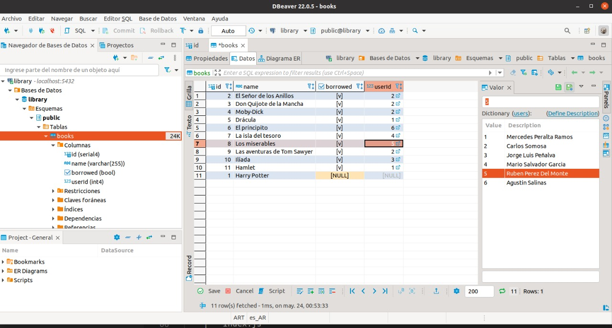
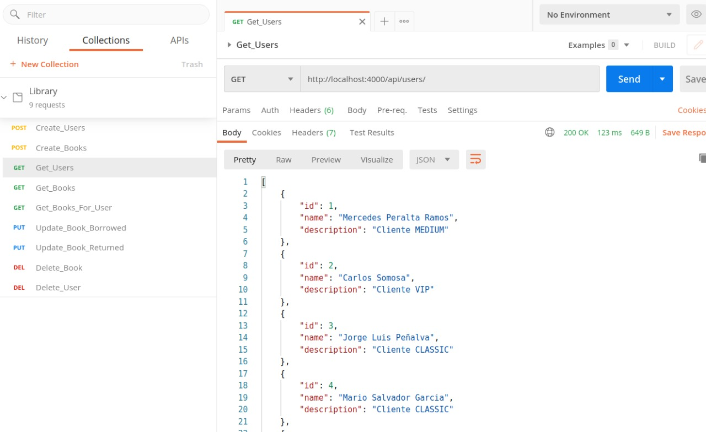

## 1) Desarrolle un script para calcular la secuencia de fibonacci según un número ingresado por entrada estándar, tomando este como el límite de la secuencia.

## Getting started
1. Clone the project to your machine ```[git clone https://github.com/leo-frison/mercat.git]
2. Navigate into the diretory ```[cd mercat/Fibonacci&Palindromo]```
3. To run the script open ```[Fibonacci.html]``` with live server

## 2) Crear un script que al ingresar una palabra por entrada estándar identifique si es un palíndromo o no.

## Getting started
1. Clone the project to your machine ```[git clone https://github.com/leo-frison/mercat.git]
2. Navigate into the diretory ```[cd mercat/Fibonacci&Palindromo]```
3. To run the script execute  ```[node Palindromo.js]```


## 3.- Una biblioteca necesita realizar un sistema de inventario en el cual pueda llevar un registro de los libros que puede prestar a un usuario.
1. Realice una API en Rails 5 sin autenticación
2. Realizar Endpoint CRUD para Libros y Usuarios
3. Desarrollar un endpoint para Préstamo y otro para Devolución tomando en cuenta
que un usuario puede solicitar y devolver varios libros
4. Agregue los atributos que estime necesarios para que se cumpla lo solicitado
5. Utilizar Interactors, POROs, active_model_serializers y Test (rspec y
shoulda-matchers)
6. Implementar este proyecto en un servicio cloud
7. Utilizar una base de datos Postgres
## Puntos Extras:
1. Configuración de Rubocop para el análisis estático del código.
2. Al momento de que a un usuario se le ha prestado un libro el sistema le tiene que
enviar una notificación por email con el libro que se ha facilitado y la fecha de
devolución de este
3. Gestionar el proyecto utilizando Git-flow
4. Levantar la aplicación en AWS
5. Construcción de documentación de la API


## Nodejs Sequelize RESTAPI PostgreSQL

This is a simple REST API using Javascript Technologies and PostgreSQL.

- nodejs
- express
- postgreSQL
- sequelize
- DBeaver
- postman

## DBeaver
Free multi-platform database tool for developers, database administrators, analysts and all people who need to work with databases. Supports all popular databases: MySQL, PostgreSQL, SQLite, Oracle, DB2, SQL Server, Sybase, MS Access, Teradata, Firebird, Apache Hive, Phoenix, Presto, etc.



## Postman
Postman is an API platform for building and using APIs. Postman simplifies each step of the API lifecycle and streamlines collaboration so you can create better APIs—faster.




## Getting started
1° Clone the project to your machine ```[git clone https://github.com/leo-frison/mercat-backend.git]``

2° To run local server execute ```[npm run dev]```


## User Structure

```bash
.
├── package.json
├── sql
│   └── db.sql
└── src
    ├── app.js
    ├── controllers
    │   ├── User.controller.js
    │   └── book.controller.js
    ├── database
    │   └── database.js
    ├── index.js
    ├── models
    │   ├── User.js
    │   └── Book.js
    └── routes
        ├── users.routes.js
        └── books.routes.js

```